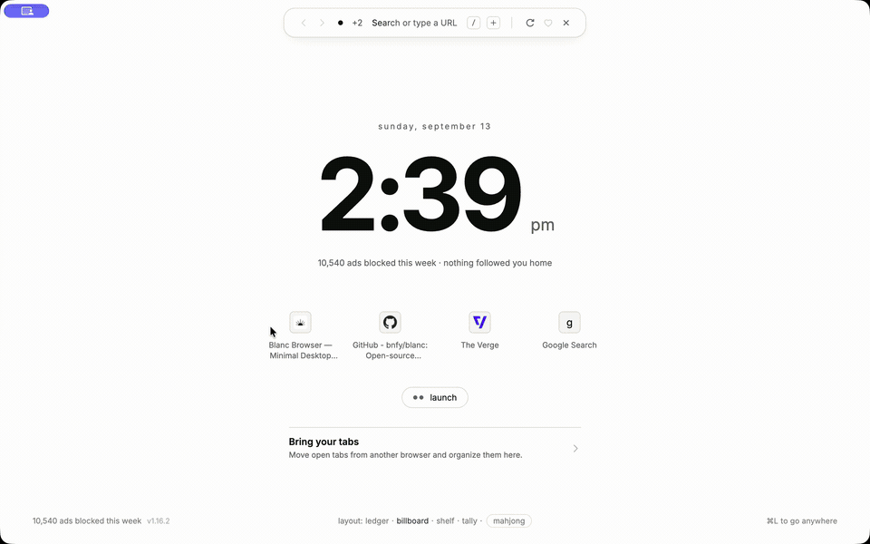

# Blanc Browser

[](docs/superpowers/plans/assets/island-demo.mp4)

A minimal Electron browser with **Island chrome**: instead of a tab strip
and toolbar, a single floating pill sits top-center over the page — tab
dots, the current site, and an ad-block counter. Click it (or hit
`Cmd/Ctrl+L`) and it expands into a command bar: address input, slash
commands, and a quick switcher across open tabs, favorites, and history.
Ad/tracker blocking is wired in at the network layer, independent of
Chrome's extension store and Manifest V3's `declarativeNetRequest` limits.
Plus favorites, history, downloads, settings, private tabs, per-site
permission prompts, session restore, and signed + notarized auto-updating
macOS builds.

> **Current release:** v1.11.1 restores microphone and camera capture on macOS
> by joining Blanc's per-site permission with the required native system access.
> It also makes the capture indicator wait for both decisions. Use the
> [v1.11.1 tag](https://github.com/bnfy/blanc/tree/v1.11.1) for the exact source
> snapshot associated with the public binaries.

## Source and license

Blanc is **open source**, released under the [MIT License](LICENSE). You can
inspect the source, build and run it locally, modify it, and publish your own
builds. A local build shows what that source does; it is not proof that a
published binary is byte-for-byte identical.

Publishing a derivative build carries two conditions the MIT grant does not
cover. The bundled EasyList and EasyPrivacy filter lists are redistributed under
[CC BY-SA 3.0 or later](https://creativecommons.org/licenses/by-sa/3.0/legalcode.en),
which requires attribution to The EasyList authors and carries share-alike terms
on the redistributed lists and Blanc's derived filter data. And the Blanc and
Bananify Creative names and logos are trademarks that a copyright licence does
not convey — ship your build under your own name and mark. Details in
[THIRD-PARTY-NOTICES.md](THIRD-PARTY-NOTICES.md) and
[ASSET-LICENSE.md](ASSET-LICENSE.md).

Published macOS releases are signed and notarized, and published Windows
releases carry timestamped Authenticode signatures. The release process signs
the complete checksum manifest with Sigstore, while Windows and Linux CI
artifacts receive GitHub provenance attestations. These records authenticate
the published artifacts; they do not make local builds reproducible. See the
[FAQ](https://blancbrowser.com/faq) for the plain-English version and the
[release repository](https://github.com/bnfy/blanc/releases) for the records.

## Free browser, optional Patron

Everything that makes Blanc a browser is free: ad and tracker blocking,
encrypted sync, private tabs, tab groups, quiet tabs, and passkeys. Blanc
Patron costs $30 a year or $4 a month and, on macOS, adds three Dock colorways;
on every platform, it also adds Named Workspaces. Creating a named workspace
requires an active Patron subscription. Renaming and removing existing
workspaces continue to work if it lapses.

The memory benchmark, method, and raw runs are in
[`bench/memory/`](bench/memory/).

## Install

Grab the latest build from
[Releases](https://github.com/bnfy/blanc/releases/latest): macOS (explicit
Apple Silicon and/or Intel dmg/zip artifacts, signed & notarized), Windows
(code-signed NSIS installer when included in the release), or Linux
(x86_64 AppImage).
Installed copies keep themselves current via auto-update.

## Run it from source

```
npm install
npm start
```

On first launch, Blanc verifies and compiles the reviewed EasyList +
EasyPrivacy snapshots bundled with that release. It does not download filter
code at startup. Web navigation waits for that protection; if the build fails,
the start page offers Retry or an explicit Continue without blocking. The
compiled engine is cached in userData; deleting `adblock-engine.v*.bin` forces
a rebuild from the same bundled snapshot. Search suggestions and bounded usage
measurement are both presented on, but cannot send until the first-run choices are
saved and can be turned off before continuing.
Dev runs use their own userData profile and never send usage events.

To build an installable app: `npm run dist` (or `npm run dist:dir` for a
quick unpacked build in `dist/`). Targets: macOS dmg/zip, Windows NSIS,
Linux AppImage. `build/icon.png` (1024×1024) is the app icon source;
electron-builder derives the .icns/.ico from it automatically.

## The island

**Resting pill on `main`:** up to eight direct dots combine standalone pinned
tabs with the active named group, loose-tab section, or pinned shelf. A
window-wide `+N` counts every omitted tab and opens the full list. Accent means
active, pulsing means loading, and hollow means private. Quiet tabs keep their
normal dot and click-to-wake behavior.

The pill also shows the active site's favicon and domain and the count of
ads/trackers blocked on the page. Click a dot to switch tabs without expanding.
The strip behind the pill tints itself with the page's own top-edge color, so
the chrome reads as a continuation of the site rather than a bar above it.

**Expanded command bar** (click the pill): address input,
back/forward/reload, favorite (heart), and a tab switcher. `Cmd/Ctrl+L`
summons the same panel as a centered palette over a scrim, from anywhere.
Esc, ✕, or clicking outside dismisses. The expanded states float *over*
the page — they never push content around.

**Slash commands** — type `/` in the input:

| | |
|---|---|
| `/favorites` `/history` `/downloads` `/settings` | open internal pages |
| `/new` `/private` `/close` | tab management |
| `/find` | find in page |
| `/clear` | clear browsing history |
| `/block-ads` | toggle ad & tracker blocking |
| `/allow-ads` | allow ads on the current site |
| `/theme` | cycle appearance (system → light → dark) |

**Quick switcher + search** — type anything else and the island blends
loose local matches (tabs, favorites, history, and groups) with live
autocomplete from the search engine selected in Settings. Arrow keys move
through the six-row result list; Enter keeps the existing confident-local
match behavior, otherwise it searches the exact text you typed. Provider
suggestions are presented on and can be disabled before continuing or later in Settings.

**Glance** (`Cmd/Ctrl+Shift+G`): choose another tab from the current window
and keep it visible as a temporary reference beside the main page. The main
page stays dominant; the reference can be changed, made main explicitly, or
closed without closing its tab. Narrow windows stack the reference below the
main page, and Glance never persists or syncs the relationship.

**Private tabs** (`/private` or `Cmd/Ctrl+Shift+N`): nothing is saved to
history, they're excluded from session restore and reopen-closed-tab, and
popups they open stay private. Cookies, storage, cache, service workers, HTTP
auth, and permission decisions live in a separate in-memory session that is
discarded when Blanc quits. The whole chrome shifts to a deeper neutral
private theme while one is active, and the pill grows a `private ✕`
chip for a quick exit.

## Auto-updates

Packaged builds self-update via `electron-updater` against GitHub
Releases. Chromium can't be swapped out of a running app — it's compiled
into Electron — so, like Chrome itself, staying current means replacing
the whole app: bump the `electron` dependency (it tracks Chromium stable)
and `version`, then `npm run release`. That builds, signs, and notarizes
the macOS artifacts locally (see `scripts/release.sh`), then dispatches
[`release-windows-linux.yml`](.github/workflows/release-windows-linux.yml)
to build the NSIS installer and AppImage on their native runners and
upload them onto the same release. The Windows build signs via Azure
Trusted Signing if configured (repo secrets `AZURE_TENANT_ID`/
`AZURE_CLIENT_ID`/`AZURE_CLIENT_SECRET` + repo variables
`AZURE_TRUSTED_SIGNING_ENDPOINT`/`AZURE_CODE_SIGNING_ACCOUNT_NAME`/
`AZURE_CERTIFICATE_PROFILE_NAME`/`AZURE_PUBLISHER_NAME`), else falls back
to a traditional cert via `CSC_LINK`/`CSC_KEY_PASSWORD` secrets. A release
workflow without either complete signing path fails instead of publishing
an unsigned Windows press artifact; a traditionally signed build that still
has a SmartScreen reputation warning is treated as Preview, not Stable.
Running installs pick releases up on their
next check (startup + every
4 h, or **Check for Updates…** in the menu) and prompt to restart. Dev
builds (`npm start`) skip all of this.

## How it's put together

```
src/main/main.js         Window, per-tab WebContentsViews, island overlay, IPC, menu
src/main/adblock.js      Network + cosmetic ad blocking (@ghostery/adblocker-electron)
src/main/pages.js        blanc:// scheme for internal pages + their guarded IPC API
src/main/permissions.js  Deny-by-default permission policy + per-site prompt decisions
src/main/downloads.js    Download tracking (will-download), open/show/cancel actions
src/main/bookmarks.js    Favorites store
src/main/history.js      Visit recording + search
src/main/settings.js     Search engine / adblock / theme / home page settings
src/main/search-suggestions.js  Bounded default-engine autocomplete providers
src/main/store.js        Tiny debounced JSON-file persistence used by all of the above
src/main/context-menu.js Right-click menu for web content
src/main/auth-dialog.js  HTTP basic/digest auth prompt
src/main/updater.js      electron-updater wiring
src/main/preload.js      contextBridge API for the chrome strip + island overlay
src/main/tab-preload.js  contextBridge API for blanc:// internal pages only
src/renderer/            The chrome: strip + resting pill (index.html), island overlay (overlay.html)
src/renderer/pages/      Internal pages: newtab, favorites, history, downloads, settings
```

**Many `BrowserWindow`s, each with many `WebContentsView`s.** Each native
window owns an independent runtime for its tabs, groups, chrome surfaces, and
local-profile identity. The window's own `webContents` renders the chrome strip
— the slim band the resting pill floats in. Each tab is a separate
`WebContentsView` added to its owning window's `contentView`; only the active
tab's view is attached, so switching
tabs is just remove-one/add-another rather than destroying anything. The
island's expanded states live in one more `WebContentsView` — transparent,
attached on top only while open — which is how the command bar, palette,
and find capsule float over the page instead of reserving space. Tab
state lives in the main process; both chrome documents just reflect
`tabs:updated` broadcasts.

Personal keeps the existing root data files and Electron default session.
Named local profiles isolate site storage, Favorites, history, download
metadata, remembered permissions, and normal/private browsing sessions; the
existing Profile Sync consent remains Personal-only.

**Security posture:** the chrome strip, the overlay, and every tab run
with `contextIsolation: true`, `nodeIntegration: false`, `sandbox: true`.
Tabs carry `tab-preload.js`, but each `blanc://` host receives only its own
bridge methods. The main process independently verifies the exact host,
owned WebContents/session/surface, and main frame for every `pages:*` call.
Ordinary web content gets no bridge. The richer `browserAPI` is attached only
to Blanc's chrome documents and is independently sender-checked.

**Permissions:** deny-by-default. Camera, microphone, geolocation, and
notifications surface a per-site Allow/Block prompt in the chrome; the
decision is remembered per origin and manageable in Settings. Everything
else (screen capture, MIDI, etc.) is refused outright; fullscreen, pointer
lock, and sanitized clipboard writes are allowed.

**Ad blocking:** `adblock.js` attaches a `@ghostery/adblocker-electron`
engine to `session.defaultSession` once at startup, covering every tab.
Request-level blocking isn't bound by MV3's rule caps. The engine is built
from bundled, hash-verified snapshots; blocker scriptlets update only with the
signed app snapshot and run with isolated declarations. Blocked requests are counted per tab and surface as the accent badge in the pill. Toggle the engine in
Settings (or `/block-ads`); exempt individual sites per-site (`/allow-ads`,
also editable in Settings).

**Internal pages** (`blanc://newtab`, `bookmarks`, `history`,
`downloads`, `settings`) are served over a privileged custom scheme by
`pages.js` — a real origin, so web content can't link into arbitrary local
files. The user-facing name for bookmarks is **Favorites** (heart icon);
the identifiers keep the classic name. Fresh profiles can bring Favorites
directly from detected Chrome, Edge, Brave, Chromium, or Vivaldi profiles;
the Favorites sheet keeps that explicit, deduplicating import available later,
alongside the universal bookmarks-HTML fallback. Profile paths and raw browser
data never cross into a renderer.

**No Chrome extensions — by design.** Ad blocking is built in at the network
layer (above). On macOS, Blanc can also fill a matching Login item from the
installed 1Password desktop app when the user explicitly asks it to. That is a
narrow, opt-in SDK integration—not an extension runtime or a Blanc-owned
password store. Other password-manager browser integrations generally rely on
vendor code-signing allowlists. Bowser, Blanc's former name, appears in Apple's
allowlist source through
[apple/password-manager-resources#1137](https://github.com/apple/password-manager-resources/pull/1137),
but that historical entry is separate from the 1Password feature.
Skipping an extension runtime also keeps the whole chrome sandboxed and
the app small.

**Persistence** is deliberately boring: one JSON file per store
(`settings.json`, `bookmarks.json`, `history.json`, `downloads.json`,
`session.json`, `site-permissions.json`) in userData, written through a
shared debounced `JsonStore` using owner-only permissions and atomic
replacement. The retained Profile Sync key is wrapped by the operating
system credential service. History is capped at 5000 entries, the
download log at 200. Open tabs are restored on the next launch — private
tabs excepted.

**Theming:** one green identity in two lights — bone by day, charcoal by
night, pine (deep) or sage (bright) as the accent depending on which —
plus a dedicated green-night scope for private tabs. Settings → Appearance
(System/Light/Dark) drives Electron's `nativeTheme` so the chrome,
internal pages, and web content all follow one switch, no restart.

**Address input** is normalized in `main.js` — "has a scheme," "looks
like a domain," or "treat as a search query" (engine selectable in
Settings: DuckDuckGo, Google, Bing, Brave). Search-like input also gets
best-effort autocomplete from that engine; URLs, input typed in private
tabs, pasted values, and sensitive-looking text stay local. The separate
Search suggestions toggle is device-local and can disable provider requests
entirely.

## Keyboard shortcuts

| | |
|---|---|
| `Cmd/Ctrl+T` / `Cmd/Ctrl+W` | new / close tab |
| `Cmd/Ctrl+Shift+N` | new private tab |
| `Cmd/Ctrl+Shift+T` | reopen closed tab |
| `Cmd/Ctrl+L` | search, tabs & commands |
| `Cmd/Ctrl+F` | find in page |
| `Cmd/Ctrl+R` | reload |
| `Ctrl+Tab` / `Ctrl+Shift+Tab` | next / previous tab |
| `Cmd/Ctrl+1…9` | jump to tab (9 = last) |
| `Cmd/Ctrl+D` | add to favorites |
| `Cmd+Alt+B` / `Ctrl+Shift+O` | favorites |
| `Cmd/Ctrl+Y` | history |
| `Cmd/Ctrl+Shift+J` | downloads |
| `Cmd/Ctrl+Shift+G` | open / close Glance |
| `Cmd/Ctrl+,` | settings |
| `Cmd/Ctrl` `+` / `−` / `0` | zoom in / out / reset |

## What's still left

- **Passkeys** — WebAuthn works with security keys. On supported Macs, Blanc
  can also create and use device-bound Touch ID passkeys stored in its own
  Secure Enclave keychain group. Existing iCloud Passwords and third-party
  credential-manager passkeys still await Apple's grant of the
  `com.apple.developer.web-browser.public-key-credential` entitlement
  (requested).
## Rebrand cleanup still pending

This app was renamed from "Bowser" to Blanc — the code, package identity,
and visual assets are done, but a few infra steps are deliberately not yet
live:

- The marketing site (`site/`) is live on the Cloudflare Pages project
  `blancbrowser` (direct upload: `npm run site:deploy`, which builds the
  Astro site and uploads `site/dist`), served at the canonical domain
  `blancbrowser.com`. `getbowser.com` 301-redirects there path-for-path
  (live since 2026-07-11), so search consolidates onto the canonical domain.
- This file's still-old-name architecture references were updated, but a
  fuller pass to make sure nothing else in the repo (scripts, docs, comments)
  assumes "Bowser" would be worth a final sweep before the first real
  "Blanc" release ships.

## Known rough edges

- `normalizeAddressInput()`'s domain-detection regex is intentionally
  simple; it'll misclassify some edge cases (e.g. paths with dots in query
  strings). Known, accepted.
- Per-site ad-block exceptions cover network-level blocking; cosmetic
  element-hiding isn't scoped per-site.
- The downloads page polls while visible instead of receiving push
  updates — simple, but a push channel would be cleaner.
