# Named Workspaces — live screenshot review

September 13, 2026 · installed Blanc v1.16.2 · macOS · 1229 × 768 captures.

**Verdict:** The UI is visually compact and consistent, but switching does not preserve unsaved page work. Feedback competes with the address bar and other warnings, and the small workspace footer obscures identity. The live pass reproduced five findings from the [source audit](report.md).

All screenshots below were captured in this run, saved without alteration, and reopened for inspection. The test page contains only disposable audit text. No original workspace was deleted or renamed. Screenshot numbering follows capture order.

## 1. Resting chrome — identity needs improvement

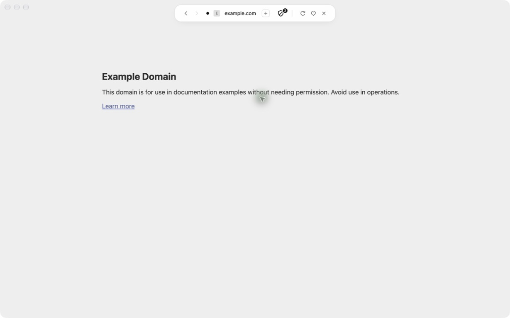

The page has ample space and the island stays unobtrusive. Workspaces have no visible entry label here; discovering the feature requires expanding the island. Consider a compact current-workspace affordance in the resting chrome.

## 2. Attempt a switch — warning present, actions too subdued

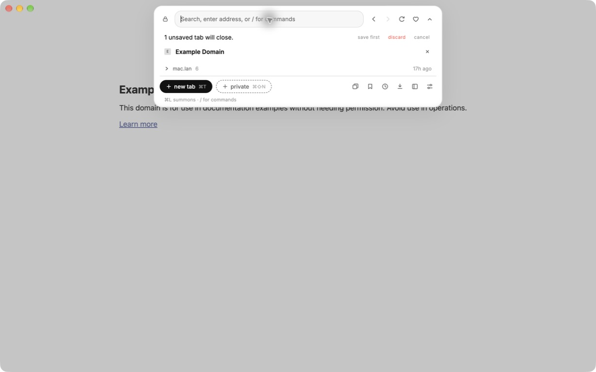

The warning is concise, with save-first, discard, and cancel choices. The actions are tiny and pale relative to the consequence. Focus remains in the address field rather than moving to the decision. This screenshot alone does not establish a measured contrast failure.

## 3. Type a command while confirmation is pending — failed

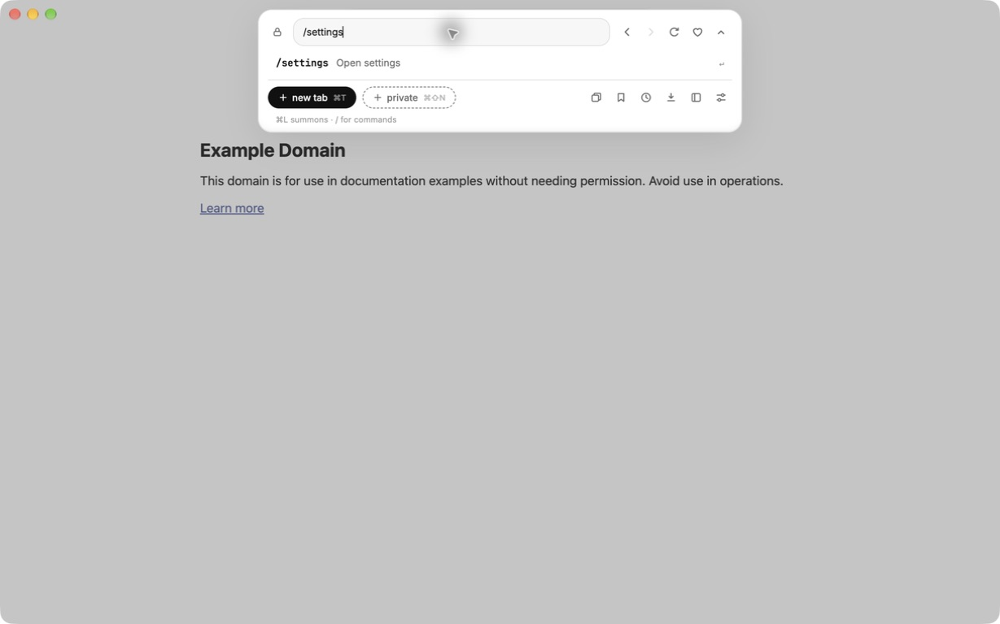

Typing `/settings` hides the pending switch warning and every decision control. Clearing the field restores them. Action feedback must remain independent of search/command results.

## 4. Save-first duplicate name — failed recovery

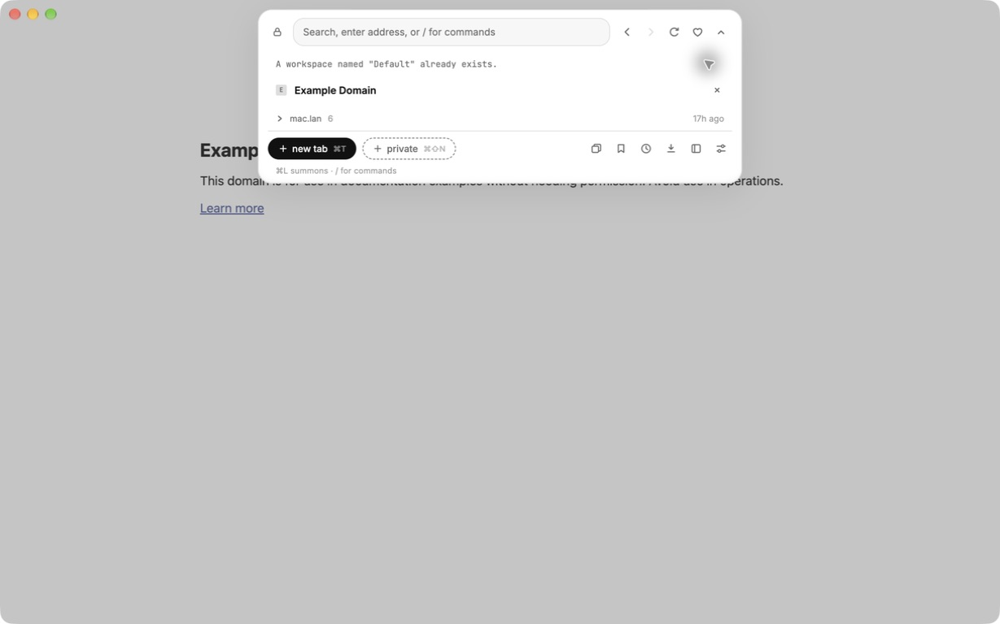

Submitting an existing name closed the editor. The duplicate-name error only became visible after cancelling the still-pending switch warning. Keep the name field open and put validation beside it; a guard and validation error must not suppress each other.

## 5. Save the audit workspace — succeeded, identity truncated

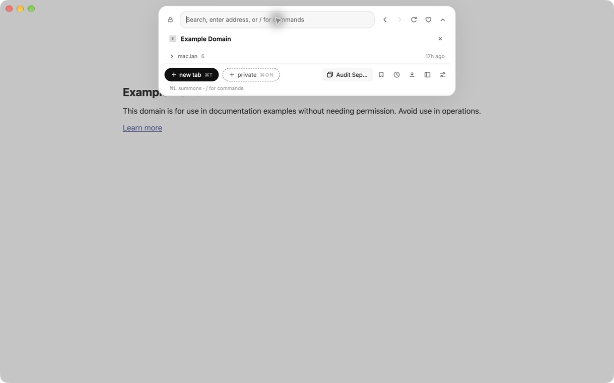

Saving the current window through `/workspace Audit September 13` succeeded and bound the window without reloading its page. The footer displays only “Audit Sep…”, even with one tab and considerable screen space. The full name is exposed through the accessibility label, which is a strength; visual identity still needs more room.

## 6. Prepare unsaved work — valid test state

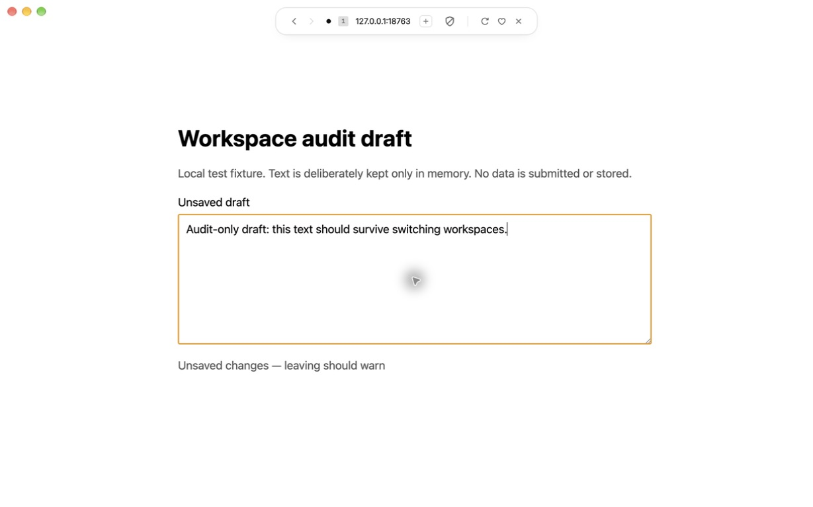

Real typing populated a local textarea. Its page installed a `beforeunload` handler and showed an unsaved-change status. The fixture deliberately stores no text on disk or in browser storage. This tests precisely the page state that a URL cannot reconstruct.

## 7. Switch away and back — critical failure

Switching to the other audit workspace produced no warning. Returning restored the URL but an empty textarea. Navigation history also no longer exposed the earlier back destination in the accessibility tree. Fix protection of page work before polishing the switcher.

## 8. Select the current workspace with a private tab — incorrect warning

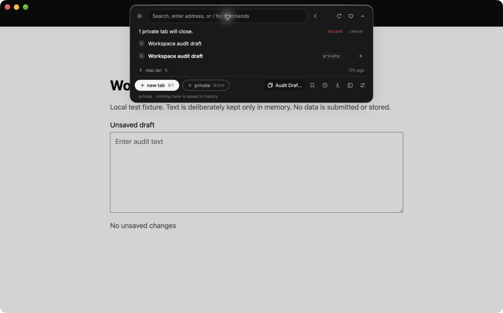

The active workspace was already “Audit Draft September 13”. Selecting that exact name through `/workspace` nevertheless claimed its private tab would close. The private theme and per-tab private badge clearly communicate privacy, but the guard must only apply when an actual swap will occur. The action was cancelled.

## 9. Close every ordinary tab, leave a private tab — valid empty saved set

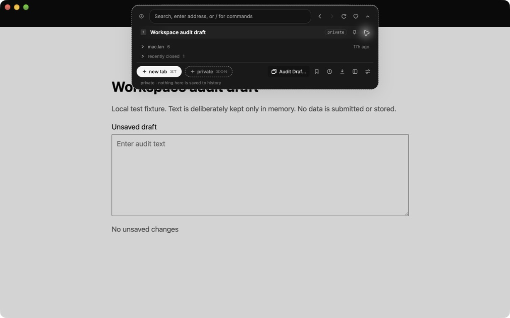

The ordinary audit page was explicitly closed; the remaining row is labelled private. Recently Closed correctly shows the ordinary close. The secondary window was then closed. A workspace snapshot should now have no ordinary page to restore.

## 10. Open the saved workspace in a fresh window — stale tab restored

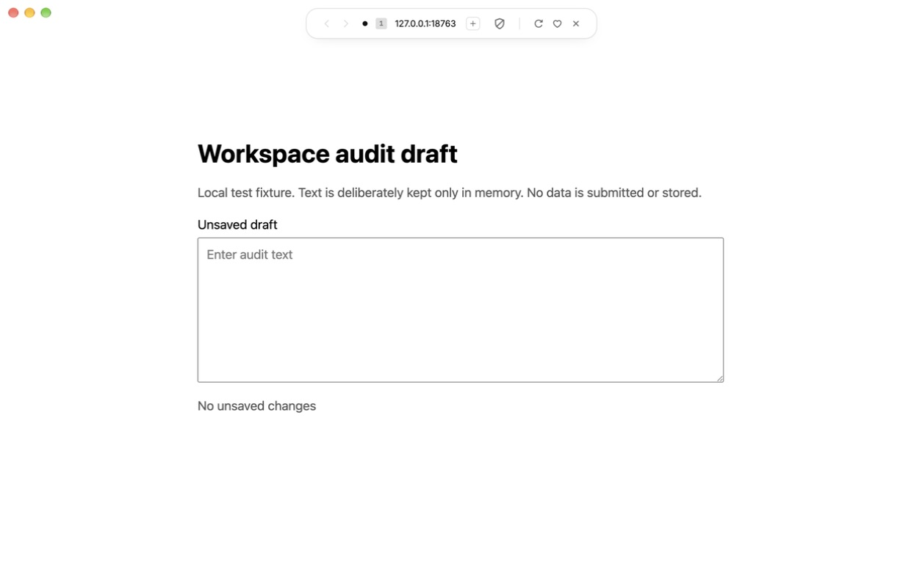

The ordinary page returned at its non-private URL. The private page did not return, so private exclusion worked. The defect is skipping the legitimate empty ordinary-tab capture.

## 11. Open Rename from the row's context menu — functional, limited affordance

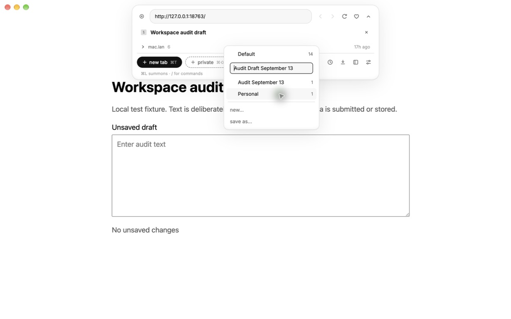

Rename focuses a field containing the old name. Management is accessible through right-click, but no visible row action hints at it. There are no explicit save/cancel buttons or keyboard hints in the editor. New and Save As remain visible during rename, adding competing actions.

## 12. Submit a duplicate rename — failed recovery

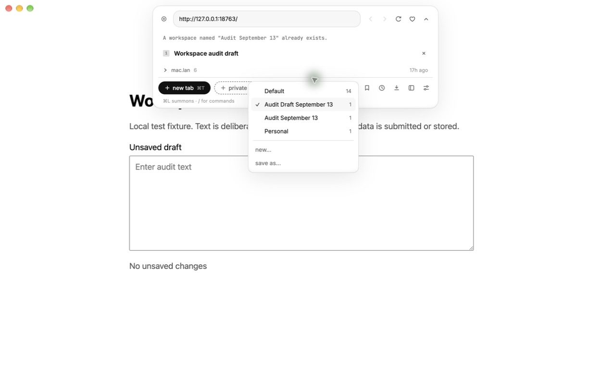

The name field disappears on failure. The error appears above the tab list, spatially separated from the workspace menu. The current-workspace checkmark is visually helpful, and full names fit within this four-item menu. Preserve the editor and show the error locally.

## 13. Inspect Delete — confirmation exists, consequence unclear

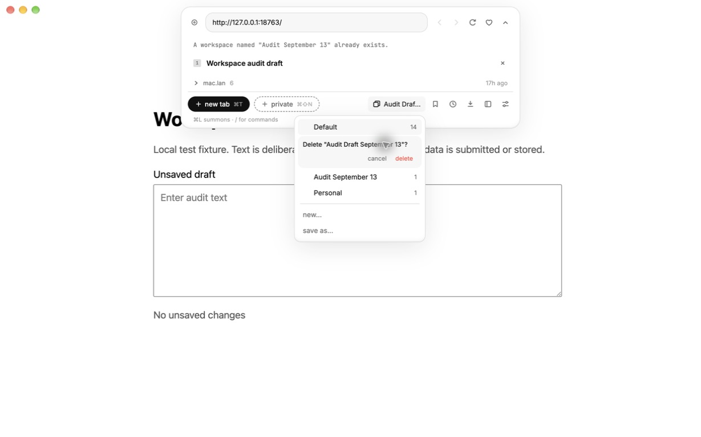

The confirmation names the workspace and uses a red delete action. It does not explain that removing the saved workspace leaves its current tabs open. The prior rename error is still visible elsewhere in the panel, so stale feedback can contradict the current action. Add clear consequences and discard irrelevant old errors when entering a new operation. Confirmation was cancelled; no deletion was committed without the owner's cleanup approval.

## 14. Approved cleanup — succeeded, stale feedback remains

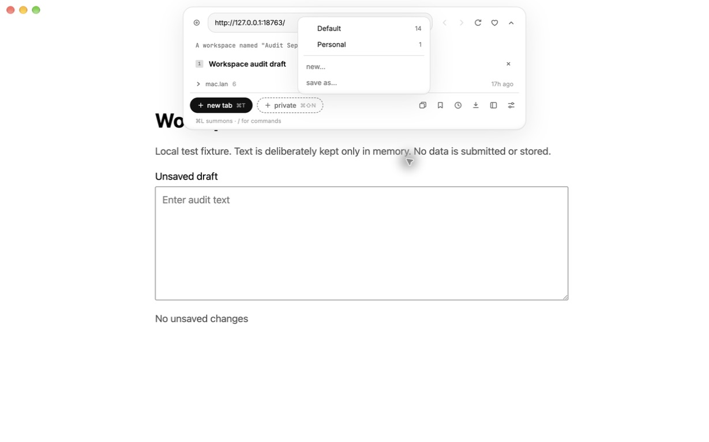

After the owner explicitly approved deletion, both audit workspaces were removed using the native row menu and final confirmation button. The switcher again contains only Default (14) and Personal (1). Deleting the bound audit workspace correctly left its current test tab open, and the window was then closed. The original browsing window remained intact and the localhost server was stopped. The old duplicate-name notice still remained above the tab list after successful deletion, reinforcing the need to clear feedback when the relevant operation changes.

## Limits and next checks

The source audit's disk-write failure, newer-format handling, and oversized-menu cases were not injected into the user's installed application. The menu initially caused Computer Use to treat it as the top-level surface and lose screenshots; entering through its native Rename/Delete context menu restored full-window capture. This is recorded as a tooling issue, not a confirmed Blanc defect. Initial new-window overlay readiness was inconsistent during automation and was not diagnosed as a workspace bug.

Screen-reader speech, complete keyboard navigation, cross-profile behavior, 25-item scrolling, minimum-size windows, Windows/Linux, and full app restart remain outside this live sample. No compliance verdict is implied. The repaired implementation should first pass the five reproduced flows, then these broader checks.
