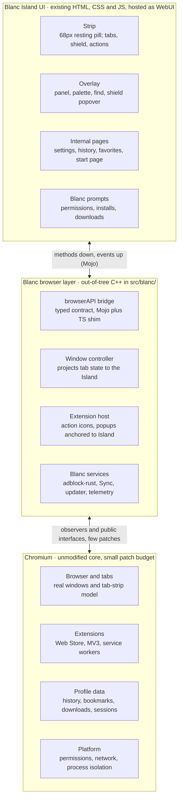
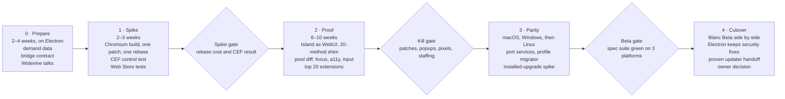

# Blanc Platform Migration: Electron to Chromium

Oct 4, 2026 · Evaluation for owner decision. Canonical working copy: the
"Blanc Platform Migration: Electron to Chromium" Claude Doc; this file is the
repository snapshot for review.

**Leading hypothesis: option C, a true Chromium-based Blanc built as a thin fork. This is not yet a recommendation.** Blanc stays on Electron, per the current platform direction, until the extension demand study and the fork spike report. No fork work starts, and no general extension runtime returns, before an owner decision.

Option C is technically credible, but six decision gates remain open: Web Store behaviour in an independently branded build, Island parity, the updater transition, extension native integration (password managers), staffing cost, and Google-service licensing. If the spike shows the cost can't be staffed, Blanc remains on Electron and accepts that some users won't switch; any curated extension support would itself need an owner decision.

## What the codebase shows

Three facts in the repository (at commit 8ec7389) change the starting assumptions.

- **The Island is not React or TypeScript.** It is plain HTML, CSS and JavaScript: about 10k lines in `src/renderer/` (`styles.css` 3.4k, `overlay.js` 2.4k, `renderer.js` 1k) plus `src/renderer/pages/`. It reaches the browser only through `window.browserAPI`, about 98 members plus a conditional 1Password member. No framework runtime makes porting easier.
- **The Electron layer is most of the app.** `src/main/` is about 47k lines of Node and Electron; `main.js` alone is 10.4k. Chromium's browser process is C++ with no Node. "Keep Blanc, replace Electron" holds for the UI and the product spec, not for the main process.
- **Option A has already been tried.** The general extension runtime was removed (commit ef1208c) after MV3 password-manager breakage, native crashes and an unsandboxed preload. The October 2 uBO feasibility study needed a shell adapter and a custom request bridge for one well-behaved MV2 extension.

One fact works in the migration's favour. The Island is a 68px strip, an on-demand overlay view and a separate permission view, all layered over each tab's own view. Chromium's Views framework composes windows the same way.

## Options compared

On paper only C meets both top requirements; that is the hypothesis the spike tests, and its cost is a permanent Chromium team.

| Option | Island preserved | Extension compatibility | Ongoing cost | Verdict |
| --- | --- | --- | --- | --- |
| A. Stay on Electron, extend support | Yes, unchanged | Capped: Electron calls full compatibility a non-goal; password managers and the Web Store flow stay broken | Low | Current platform; remains if C proves unaffordable |
| B. Migrate to CEF | Yes, as a custom shell | Good only with Chrome's own toolbar visible; custom UI loses action popups and install flows | Medium, rising sharply once you patch CEF | Reject unless the control test passes |
| C. Chromium thin fork | Yes, as WebUI layers | Near-Chrome: real tabs and windows make most APIs work unchanged | High: rebases, security respins, build infra | **Leading hypothesis** |
| Electron + community extension shims | Yes | Better than A, still a re-implementation of Chrome's model | Medium | Same ceiling as A |
| Fork Electron or CEF (Brave's Muon path) | Yes | Partial | Highest: a fork of a fork | Reject |

**Why C leads:** Chrome's extension APIs are written against Chromium's own window and tab-strip model. If Blanc's tabs are real Chromium tabs in real Chromium windows, `chrome.tabs`, `windows`, `tabGroups`, storage, messaging, service workers and permissions should work largely unchanged, which the spike must verify. Every other path re-implements that model behind a shim.

## Why CEF falls short

CEF is easy exactly where Blanc needs no help (hosting web content) and hard exactly where it does (extension UI).

- **Hiding Chrome's UI is what breaks extensions.** CEF's Chrome runtime exposes extensions through Chrome's own toolbar, puzzle menu and install bubbles. Hide them and, as far as can be checked from here (unverified; CEF's docs were unreachable), there is no public API to list extension actions, open their popups from your own button, or host install and permission flows.
- **Popups anchor to Chrome's toolbar views**, which a custom shell does not have.
- **The tab model probably doesn't match.** CEF embeds one browser at a time; extensions expect a window to hold a tab strip, so `tabs.query({currentWindow})`, groups and `windows.getAll` must reflect Blanc's tab model. CEF's own header says a Chrome style window can host at most one Chrome style browser view. That suggests one window can't hold many extension-visible tabs under Blanc's control; the control test confirms it.
- **Fixing it means a fork of a fork.** Patching CEF stacks your patches on CEF's own large patch set and its release lag.

A one-week control test settles this (see the migration plan). If CEF passes all three checks there, revisit option B.

## Target architecture

The Island talks only to a Blanc-owned bridge; the Blanc layer talks to Chromium through its public interfaces and a small, budgeted patch set.

Text version: **Blanc Island UI** (strip, overlay, internal pages, Blanc prompts) talks over Mojo to the **Blanc browser layer** in `src/blanc/` (browserAPI bridge, window controller, extension host, Blanc services), which uses Chromium's public interfaces and a small patch budget to drive **Chromium** (browser and tabs, extensions, profile data, platform).

## Preserving the Island

Pixel-for-pixel preservation is plausible but unverified; it sits behind the Phase 2 gate rather than being promised. Chromium supports Mojo-backed HTML, CSS and JS browser UI, so the direction is sound.

**How it maps:**

- **Strip:** a native web view docked at the top of the window, running the Island documents as WebUI.
- **Overlay, shield popover, find capsule:** transparent WebUI views or child widgets above tab contents, attached on demand. Chrome draws its address-bar dropdown and WebUI bubbles this way.
- **Tabs:** real tab views laid out below the strip. Today's `setActiveTab` re-stacking logic maps over directly.

**Friction points:**

- **Trusted Types and strict CSP** on Chromium's internal pages. About 20 `innerHTML` and `insertAdjacentHTML` sites in `overlay.js` and `renderer.js` need rewriting.
- **Window frames per platform:** macOS traffic lights and fullscreen, Windows caption area, Linux decorations. Blanc handles these today too.
- **Chrome's own dialogs.** Dozens of native bubbles would appear in Chrome's style. Rebuild about five as WebUI (permissions, downloads, page info / shield, extension popup framing, install confirm). Theme the rest to Blanc's tokens through Chromium's color pipeline, generated from `tokens/tokens.json` with no patches.
- **Animations crossing the strip/page boundary** composite across separate native layers, as in Electron today.

**Untested, and gated in Phase 2:** focus handoff (including the address-bar focus reclaim), the accessibility tree across layers, input routing through transparent regions, top-chrome layout, extension popup anchoring and platform frames.

## The bridge

Formalise the existing `browserAPI` as one typed contract, then implement it twice so the Island never knows which engine it runs on.

1. **Contract.** Methods, events and payload shapes in a source-of-truth file, in the style of `tokens/`, `settings-schema/` and `copy/`. Generate TypeScript types from it.
2. **Electron implementation.** Today's `preload.js`, made to conform. This ships value now regardless of the migration decision.
3. **Chromium implementation.** A Mojo interface generated from the same contract: a page handler (UI to browser) and a page interface (browser-to-UI events, replacing `tabs:updated`). A small shim keeps exposing `window.browserAPI`, so renderer code should need little change.
4. **Native controller.** A C++ `BlancBrowserController` per window observes tabs, page contents, downloads, permissions and extension actions, and projects state to the Island as `main.js` does now.
5. **Shared contract tests** run against both builds.

Internal pages (`blanc://settings` and the others) become WebUI pages with their own handlers, and the flat-file restriction in `pages.js` goes away.

## What survives

Well under 10% of `src/main` survives as code; the rest survives as behaviour already specified in `spec/` and covered by tests. That spec is the migration's most valuable asset.

| Fate | What |
| --- | --- |
| Survives largely as-is | Renderer HTML/CSS/JS, internal pages, design system, `tokens/`, `settings-schema/`, `copy/`, `spec/` (features F1–F41, divergences D#, Gherkin), Mahjong, `site/`, Cloudflare sync and telemetry Workers |
| Potential built-in replacements | Basic tab and window management, navigation, history storage, bookmark storage (keep the Favorites label), download storage, default-browser handling |
| Adapt: reimplement on Chromium primitives | **Quiet Tabs**: bounded navigation snapshots and the sessionStorage-preserving rules, on top of Chromium tab discarding. **Reopen Closed Tab**: live-view, snapshot and URL tiers, on top of tab restore. **Local profiles and private tabs**: Blanc isolation and persistence policy on Chromium profiles. **Permissions, capture indicator, WebAuthn**: Blanc UI and trust controls on Chromium's permission, media-capture and WebAuthn stacks. Session metadata and restore rules. |
| Adapt: code and tests | `preload.js` and `tab-preload.js` become the Mojo shim. Pure policy modules (`tab-sleep`, `closed-tabs`, `*-model.js`) become C++ ports with their unit tests as language-neutral vectors. `sync-crypto` moves to C++ with interop vectors so existing sync accounts keep working. The Cucumber harness drives Chromium over CDP instead of `test-hook.js`. |
| Retain until proven | The 1Password broker, until the 1Password extension works with desktop integration in signed Blanc builds at behavioural parity |
| Deleted once replaced and verified | Electron workarounds (`chrome-compat-preload`, client-hint shims, fuse checks, capture preload variants, WebRTC workarounds); the 16 `ublock-*` adapter files if blocking moves native; electron-builder and electron-updater after the installed-upgrade spike passes |
| New work | WebUI hosting and layout, extension action and popup integration, native ad blocker, updater (Sparkle on macOS, Omaha-style or Chromium's own on Windows), a Linux distribution decision (AppImage continuity or new package repositories), packaging and signing, proxies for Google service endpoints |

## How extensions would work

With real Chromium tabs and windows, most of the extension platform should work largely unchanged; Blanc's own work concentrates on action popups and a few UI hooks.

| Area | Expected behaviour in a Chromium Blanc | Status and Blanc work |
| --- | --- | --- |
| Web Store install | Chromium contains the private store API (`webstorePrivate`) and install machinery. Brave, Vivaldi, Opera and Helium install from the store. | **Unverified for an independently branded build.** Phase 1 acceptance test: install, permission prompts, policy behaviour |
| Updates | Checks against Google's update servers | Phase 1 acceptance test; optional proxy to avoid leaking the extension list (Helium reportedly does this; Brave does not proxy Web Store extensions) |
| Service workers, content scripts, storage, messaging, permissions | Expected unchanged | Verified by the Phase 2 extension suite |
| `tabs`, `windows`, `tabGroups` | Expected unchanged, because tabs live in Chromium's tab-strip model | Verified in Phase 2; Blanc ignores group colours in display |
| Toolbar actions and popups | The Island shows icons and badges from Chromium's extension toolbar model. A click opens a native popup anchored to an invisible view placed at the Island button. | The main Blanc-owned code. `ExtensionsContainer` exposes popup ownership and action APIs; an invisible Island anchor is unproven |
| `chrome.omnibox` | Wire Chromium's autocomplete into the Quick Switcher, which also brings real history and bookmark ranking | Island integration |
| Side panel, new-tab overrides | Side panel needs a host; new-tab overrides collide with the Start Page by design | Product decisions |

**Gaps that remain even in a fork:**

- `chrome.identity.getAuthToken` requires Chrome sign-in, which forks don't get. `launchWebAuthFlow` works.
- Native-messaging hosts install manifests into each browser's own directory.
- **1Password and Bitwarden desktop apps integrate only with browsers they recognise.** Bitwarden's desktop app writes its native-messaging manifests only for a hardcoded browser list, which Helium was added to. 1Password reportedly allows a manual add on macOS and Linux but not Windows (unverified). Getting Blanc listed is a business task; start early. The existing 1Password broker stays until this works.
- **MV2 and uBO.** Chromium has been removing MV2; Brave and Helium carry patches for a few allowlisted extensions. Recommended: native blocking in the network layer with `adblock-rust` (Brave's MPL-2.0 engine), uBO Lite as an opt-in. This also affects today's Electron uBO, since Electron inherits the same extension code.

## Licensing, services and distribution

A Chromium fork gets the engine, not Google's services; Widevine is the longest lead-time item.

| Item | What applies | Action |
| --- | --- | --- |
| Chromium licence | BSD-3 plus thousands of third-party licences; compatible with Blanc's MIT and carve-out model | Ship a credits page |
| Trademarks | No "Chrome" name or logos; "built on Chromium" is fine | Branding review |
| Chrome Sync and Google sign-in | Withdrawn from third-party Chromium browsers in 2021 | Keep Blanc Profile Sync |
| Translate, geolocation, Web Push (FCM) | Each needs your own keys or providers; push is hard, per Brave's experience | Choose providers |
| Safe Browsing | The free API is non-commercial-only; commercial use goes through paid Web Risk. Brave proxies it. Blanc on Electron has none today. | Decide provider and budget |
| Component updater | CRLSets, Certificate Transparency logs, Widevine and origin trials come from Google; security-relevant | Fetch or proxy |
| Chrome Web Store | No contract grants third-party browsers access; derived builds also face API-key and service restrictions | Phase 1 acceptance test, then accept the residual dependency risk |
| Widevine | Needs a direct Google agreement plus VMP signing for the level Netflix and similar require; small vendors report slow or no responses; Linux gets the lowest level | **Start the conversation now** |
| Proprietary codecs | H.264, AAC, HEVC through FFmpeg carry patent-pool exposure | Prefer OS decoders; get a legal read |
| Distribution | Signing, notarization, Sigstore and SBOM gates carry over | Keep `me.bnfy.bowser`; necessary for continuity, but the updater handoff itself is unproven (installed-upgrade spike) |

## Ongoing burden and patch surface

Staffing hypothesis: at least one engineer fully on rebases and security, plus about one on Blanc's browser layer. Only the release cadence is documented by Chromium; every other figure below is a planning assumption that the Phase 1 spike replaces with measured data.

| Item | Cadence or estimate |
| --- | --- |
| Chromium major versions | Every 4 weeks (8 on Extended Stable) |
| Security respins | Roughly weekly; must ship within days, so mostly automated |
| Rebase, small patch set | About 2–5 engineer-days per major (hypothesis) |
| Security bump | About half a day of human time once automated (hypothesis) |
| CI | Four platform targets × multi-hour clean builds; about $2–6k/month (hypothesis); at least 100 GB disk per checkout |

**Keeping patches small:**

1. Brave's layout: an out-of-tree `src/blanc/` with its own BUILD files, hooked in by a handful of patches. Prefer `chromium_src` override files (your copy wraps upstream's) to diff hunks.
2. Use Chromium's own extension points first: browser-window and layout delegates, `ExtensionsContainer`, permission-prompt factories, color mixers, feature-flag defaults in Blanc's main delegate, enterprise-policy defaults for disabling Google features.
3. Never fork the tab-strip model, the browser object or the extension system. If a design needs that, change the design.
4. Treat patch count as a CI-enforced budget, for example at most ~40 patched files, with the touched-hunk count reported on every rebase.
5. Prefer one Blanc-owned interface plus one Chromium hook over many scattered edits.

## Lessons from Brave and others

Copy Brave's engineering structure, not its UI decision.

| Browser | What happened | Lesson for Blanc |
| --- | --- | --- |
| Brave | Forked Electron into "Muon" to add Chrome extensions, abandoned it, rebuilt as brave-core on Chromium | Don't fork Electron or CEF as an intermediate step |
| Brave | Threw away its React browser UI and adopted Chrome's | **Does not apply**: the Island is Blanc's differentiator |
| Brave | Out-of-tree code, override files, proxied Google endpoints, native Rust blocking, dedicated rebase rotation | Apply all of these |
| Vivaldi | Web-based UI on Chromium with full Web Store support | Proves a web UI can drive Chromium; Blanc's layered views avoid rendering the whole window as one page |
| Arc | Native custom UI on Chromium | A distinctive shell over Chromium is viable |
| Helium | Small team, Chromium-derived, carries uBO MV2 | A small team can maintain a fork when the patch set is small |

Not applicable: Brave's scale and the funding behind it.

## Migration plan

Phases 0 and 1 are cheap and useful on any path, and Blanc stays on Electron throughout them. The full migration is committed only after the kill gate, and only by owner decision.

Text version:

1. **Phase 0, Prepare (2–4 weeks, on Electron):** demand data, bridge contract, test vectors, Widevine talks.
2. **Phase 1, Spike (2–3 weeks):** Chromium build with one patch and one rebase; CEF control test; Web Store acceptance tests. Spike gate: measured rebase cost and the CEF result.
3. **Phase 2, Proof (6–10 weeks):** Island as WebUI, a 20-method shim, pixel diff, focus, accessibility and input routing, top 20 extensions. Kill gate: patch budget, popups, pixels, staffing.
4. **Phase 3, Parity:** macOS, Windows, then Linux; port services; profile migrator; installed-upgrade spike. Beta gate: spec suite green on three platforms.
5. **Phase 4, Cutover:** Blanc Beta side by side; Electron keeps security fixes; a proven updater handoff; owner decision.

**Phase 2 stops if any of these hits:**

1. The patch budget is exceeded.
2. Action popups can't attach to the Island without invasive patches.
3. Pixel parity with today's Island needs a UI rewrite.
4. Measured rebase and security cost won't fit available staffing.

**CEF control test (Phase 1, one week).** With Chrome's toolbar hidden, can a custom UI (a) see multiple tabs per window in `tabs.query`, (b) open an action popup from its own button, (c) run a Web Store install and its permission prompt? Passing all three reopens option B.

**Web Store acceptance (Phase 1).** In the branded build: install from the live store, permission prompts, extension updates and policy behaviour. Failure here blocks option C regardless of the Island work.

**Cutover.** Unproven. Keeping the bundle ID is necessary for macOS continuity but proves nothing else. A dedicated installed-upgrade spike on macOS, Windows and Linux must show Electron-to-Chromium replacement through the shipping updater, user-data migration, signing and publisher continuity, rollback, and handover of updater ownership. Linux package repositories would be a new distribution strategy, not a drop-in for AppImage. Electron Blanc keeps receiving security updates until cutover.

## Open questions and caveats

- [ ] Which extensions do users actually request? Tag every request from support, GitHub, Reddit and Product Hunt with name and APIs used.
- [ ] Can an independently branded build install and update from the live Chrome Web Store? Phase 1 acceptance test.
- [ ] Does the Island reach parity as WebUI, including focus, accessibility and input routing? Phase 2.
- [ ] Can the shipping updater hand off to a Chromium build on all three platforms, with data migration and rollback? Installed-upgrade spike.
- [ ] Does the 1Password extension work with desktop integration in signed Blanc builds? Until it does, the broker stays.
- [ ] Can Blanc fund the measured staffing and CI cost? The figures in this doc are hypotheses.
- [ ] How does CEF map multiple tabs per window today? Settled by the control test.
- [ ] Current state of MV2 at the spike's Chromium version.
- [ ] Widevine: has Google responded?
- [ ] Which Google services (Safe Browsing, push, geolocation, translate) need paid or alternative providers?

This analysis draws on the repository at commit 8ec7389 and on knowledge of Chromium, CEF and Electron through mid-2026. External claims were checked on October 4 where reachable; the Sources section below records the status of each. An independent review on October 4 confirmed the Electron, uBO, ExtensionsContainer, Google private-API, Safe Browsing and codec claims, and its corrections are incorporated here. It does not authorise fork work: the current `CLAUDE.md` direction holds until the owner decides.

## Sources and verification status

As of Oct 4, 2026, 11 of the doc's external claims are verified against pages opened for this doc, and 4 more (one row) rest on the October 4 review. The other 8 are secondary-only or unverified; treat them as hypotheses. Google, CEF-site, Electron-site, 1Password and Helium-site pages were blocked from the verifying environment, so GitHub mirrors were used where they exist.

| Claim | Status | Source or next step |
| --- | --- | --- |
| Electron doesn't support Web Store extensions; perfect Chrome compatibility is a non-goal | Verified | [electron/docs/api/extensions.md](https://github.com/electron/electron/blob/main/docs/api/extensions.md) |
| CEF Chrome style gives the full Chrome UI; a Chrome style window can host at most one Chrome style browser view | Verified | [cef_types_runtime.h](https://github.com/chromiumembedded/cef/blob/master/include/internal/cef_types_runtime.h) |
| A CEF custom UI loses extension action popups and install flows | Unverified | CEF docs blocked; Phase 1 control test |
| Chromium's default extension update URL is Google's (clients2.google.com/service/update2/crx), as are the store URLs | Verified | [extension_urls.cc](https://github.com/chromium/chromium/blob/main/extensions/common/extension_urls.cc) |
| An independently branded build can install and update from the live Web Store | Unverified | Phase 1 acceptance test |
| Many Google APIs used by Chrome aren't intended for derived products; keys can't be shared; quota is limited | Verified | [docs/api_keys.md](https://github.com/chromium/chromium/blob/main/docs/api_keys.md) |
| ExtensionsContainer exposes action lookup, popup show and hide, and the extensions menu; anchoring is left to subclasses | Verified | [extensions_container.h](https://github.com/chromium/chromium/blob/main/chrome/browser/ui/extensions/extensions_container.h) |
| Brave prefers chromium_src overrides to patches and keeps patches trivial | Verified | [patching_and_chromium_src.md](https://github.com/brave/brave-core/blob/master/docs/patching_and_chromium_src.md) |
| Brave proxies Safe Browsing, component updates, geolocation and push, but not Web Store extensions | Verified | [Brave deviations from Chromium](https://github.com/brave/brave-browser/wiki/Deviations-from-Chromium-%28features-we-disable-or-remove%29) |
| Muon, Brave's Electron fork with extension support, was archived on January 4, 2019 | Verified | [brave/muon](https://github.com/brave/muon) |
| Helium is based on ungoogled-chromium, GPL-3.0, and ships its own uBlock Origin fork | Verified | [imputnet/helium](https://github.com/imputnet/helium) |
| Helium keeps MV2 extensions and proxies Web Store requests | Secondary only | Search snippets only; Helium's site blocked |
| Bitwarden's desktop app writes native-messaging manifests only for a hardcoded browser list per OS, which now includes Helium | Verified | [native-messaging.main.ts](https://github.com/bitwarden/clients/blob/main/apps/desktop/src/main/native-messaging.main.ts) |
| 1Password lets users add a browser on macOS and Linux, not on Windows | Secondary only | Forum snippets only; 1Password sites blocked |
| Widevine needs a Google licence; small vendors report long waits | Unverified | Google and vendor pages blocked; ask Google directly |
| Chrome disabled MV2 extensions in 2025 | Secondary only | Search snippets only; check at the spike's Chromium version |
| A Chromium build needs at least 100 GB disk and 8 GB RAM, with over 16 GB recommended (Linux) | Verified | [linux/build_instructions.md](https://github.com/chromium/chromium/blob/main/docs/linux/build_instructions.md) |
| Staffing, rebase days and $2–6k/month CI | Unverified | Planning hypotheses; Phase 1 measures them |
| 4-week releases and 8-week Extended Stable; 2021 private-API limits; Safe Browsing non-commercial; codec differences | Verified by review | [release cycle](https://blog.chromium.org/2021/03/speeding-up-chromes-release-cycle.html), [private APIs](https://blog.chromium.org/2021/01/limiting-private-api-availability-in.html), [Safe Browsing](https://developers.google.com/safe-browsing/), [audio/video](https://www.chromium.org/audio-video/) (opened by the review) |
| Vivaldi's web-based UI and Arc's native UI on Chromium | Unverified | Not checked; illustrative precedents only |
