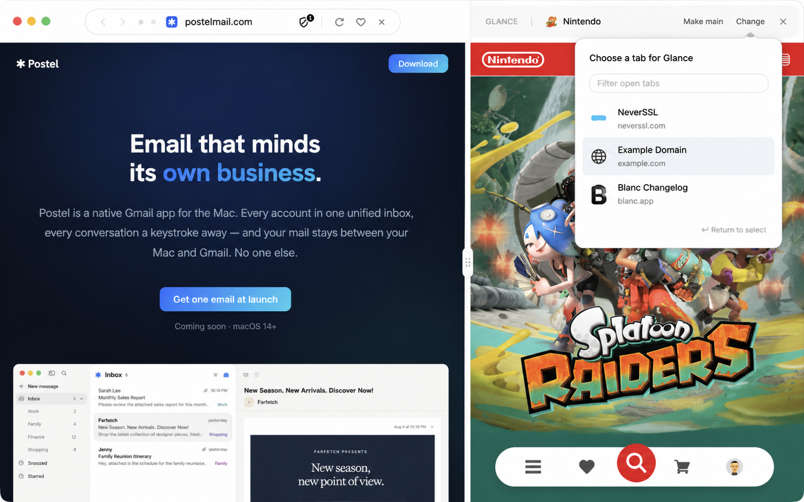

# Blanc Glance — focused reference pane

**Date:** 2026-08-15

**Status:** Implemented and production-verified
**Roadmap:** Follow-up to M2 independent windows

## Product outcome

Glance lets someone keep one tab visible as a temporary reference while they
work in another. It is intentionally not a general split-view workspace: the
main page stays visually dominant, the reference remains easy to identify and
dismiss, and both pages continue to be ordinary tabs in the current native
window and local profile.

The approved direction is **Focused Island**: the ordinary Island remains the
only floating pill, over the main page. The reference gets a quiet, flat header
that identifies Glance and exposes explicit **Make main**, **Change**, and close
actions. Choosing or changing the reference happens in a dedicated tab picker,
not the address/search panel.

The image above is the visual source of truth at the 1586×992 reference
viewport. Responsive rules below are authoritative where that image is silent.

## Entry points and dedicated picker

- `Cmd/Ctrl+Shift+G` and View → Open Glance… open a purpose-built picker when
  Glance is closed. They never guess which tab should become the reference.
- The picker is a compact popover visually attached to the Island. It contains
  the heading **Choose a tab for Glance**, an initially empty **Filter open
  tabs** field, and eligible tabs from the focused native window only.
- The picker never includes history, Favorites, remote tabs, search
  suggestions, slash commands, URLs, or navigation results. Typed text only
  filters the local eligible-tab set by title, host, and group name.
- The active main tab is ineligible and omitted. The current Glance tab is
  omitted while changing. Tabs from other native windows or profiles never
  appear. Private tabs remain eligible only inside their owning runtime; the
  row keeps the existing private treatment.
- Rows show favicon, title, and a quiet host/domain secondary label. Quiet tabs
  use their cached title/favicon and wake only after explicit selection.
- The first result is highlighted by default. Up/Down moves the highlight,
  Enter chooses it, Escape cancels, and pointer activation chooses the clicked
  row. With no match, the picker says **No matching open tabs** and Enter does
  nothing. If no eligible tabs exist, it says **Open another tab to use
  Glance**.
- Selection is transactional: the picker closes only after main confirms the
  tab is live and attached. A failed wake/attachment leaves the picker open
  with an inline **Couldn’t open that tab in Glance** message.
- Focus enters the filter field when the picker opens. Cancel returns focus to
  the invoking **Change** control when one exists; initial-picker cancellation
  returns focus to the main page. Successful selection keeps keyboard focus on
  the main page so adding a reference never interrupts the working task.
- The ordinary Island tab list retains its per-row `glance` action as a fast,
  explicit direct-selection path. It uses the same main-process validation and
  transactional result contract.

## Visible model and pane layout

- `activeTabId` remains the main page; runtime-owned `glanceTabId` identifies
  the reference. The relationship and preferred ratio are window-local and
  intentionally absent from `session.json`, Profile Sync, and crash reports.
- At page widths of 800px or more, pages sit side by side at a default 62/38
  split. The main share is clamped to 50–78 percent.
- The reference owns a flat 64px header aligned with the top strip. Its neutral
  surface prevents the main page's sampled tint from visually claiming the
  reference pane. The header shows the mono `GLANCE` eyebrow, favicon, a
  single-line tab title, and text actions **Make main**, **Change**, and close.
- The main Island stays centered over the actual main pane. No second floating
  pill, duplicate address bar, or site-control cluster appears over Glance.
- Below 800px, pages stack. The main page stays above; the divider follows it;
  a 44px full-width Glance header then introduces the lower reference page.
  This keeps ownership clear without shrinking either page into a sliver.
- Header content progressively compacts. Title truncates first, then the
  `GLANCE` eyebrow hides. **Change** and close remain visible at every supported
  width. **Make main** may collapse to an icon at the narrowest supported width
  but keeps its full accessible name and tooltip.
- Windows and Linux reserve the native window-control region before laying out
  Glance header actions. Controls never overlap or become unreachable.
- The divider is a 12px owned gap with a quiet 4px grip, large enough to target
  without making the seam visually heavy. Dragging resizes continuously.
  Arrow keys adjust by 2 percent (Shift+Arrow by 5), Home/End move to the
  supported limits, and Enter/Space or double-click resets to 62/38.
- Existing theme tokens, type families, radii, and motion curves remain
  authoritative. Glance introduces no new global color system or raster UI
  asset.

## Header actions and interaction model

- **Make main** explicitly swaps the two visible roles without navigation or
  reconstruction. The former main becomes the reference and the header updates
  in place.
- Clicking, scrolling, typing, or following a link inside the reference does
  **not** promote it. The page remains fully interactive; role changes are
  explicit through **Make main**. This is necessary for Glance to work as a
  reference rather than a preview.
- **Change** opens the same dedicated picker, positioned beneath the reference
  header action. Choosing a row replaces only `glanceTabId`; the main tab and
  its focus remain unchanged.
- Close collapses the layout but leaves the reference as an ordinary open tab.
  `Cmd/Ctrl+Shift+G` and View → Close Glance keep the same close behavior while
  Glance is open.
- Closing the reference tab collapses Glance and immediately resizes the main
  page to the full page region. Closing the main tab while Glance is visible
  promotes the reference into the full page rather than waking an unrelated
  background tab.
- A quiet tab selected for Glance wakes through the guarded wake path before it
  is attached. Both visible tab IDs are excluded from Quiet Tabs candidates.
- Tab switches, new-tab creation, utility sheets, and address-bar summoning
  dismiss the picker. Permission, capture, and shield surfaces continue to
  restack above both page panes.

## Accessibility contract

- The Glance header is a labelled group. Every action is a real button with a
  visible focus state and an accessible name that does not depend on an icon or
  tooltip.
- The picker field is a combobox owning a listbox; rows are options with stable
  IDs and `aria-selected`. Highlight changes update `aria-activedescendant`.
  Result count, empty state, selection failure, open, change, promote, and close
  outcomes are announced through a polite live region.
- The divider remains a focusable separator with orientation, minimum, maximum,
  current value, and a human-readable **Main page N percent** value.
- Focus never falls into a detached/closed WebContentsView. Picker dismissal,
  Glance close, tab close, and role swap each have an explicit focus target.
- Private styling remains supplemental; no state or action is communicated by
  color, tint, or border style alone.

## Security and privacy

- Only the main process owns WebContentsView attachment, bounds, focus, runtime
  membership, quiet-tab wake, and role changes.
- Chrome renderers receive inert tab metadata and geometry through the existing
  allowlisted preload bridge. Sender-derived IPC authorization remains in
  force for every action, including opening the dedicated picker.
- Glance introduces no new persistence, remote request, sync field, page-data
  exposure, or cross-runtime tab movement. Quiet-tab snapshots remain
  main-process-only.

## Production acceptance gate

Glance is production-ready only when all of the following pass:

1. Pure unit coverage owns horizontal and stacked geometry, header reservation,
   ratio clamping/reset, zero-size safety, and window-runtime reset.
2. Runnable desktop acceptance chooses from the dedicated picker, filters with
   keyboard input, changes the reference, proves reference interaction does not
   promote, explicitly promotes, resizes, closes, closes the underlying
   reference tab, and verifies the main page reclaims the full region.
3. Accessibility checks verify roles, names, listbox semantics, keyboard order,
   live status, focus return, and separator values.
4. Real Electron verification covers horizontal and stacked widths, macOS plus
   simulated Windows/Linux control clearance, light/dark/private appearances,
   quiet-tab selection, and no picker bleed into search/history/remote results.
5. Unit, substrate, and relevant desktop suites pass from a clean relaunch.
6. Visual Design QA compares the running app to the approved image at the same
   viewport/state. Every P0/P1/P2 discrepancy is fixed and `design-qa.md` ends
   with `final result: passed`.
7. The final diff receives a fresh correctness, regression, security, focus,
   and lifecycle review before the PR leaves draft.

## Per-workspace closed-tab recovery

The adjacent roadmap follow-up uses the same runtime boundary. Each window
owns a bounded in-memory stack of up to 25 ordinary URLs. File → Reopen Closed
Tab and `Cmd/Ctrl+Shift+T` pop only the focused runtime's stack. Private tabs,
blank new tabs, and teardown closes are not recoverable, and the stack is not
persisted or synced.

## Non-goals

- More than two simultaneous page panes.
- Persisting or syncing the Glance relationship.
- Cross-window or cross-profile tab movement.
- A second address bar, independent navigation chrome, or a general split-view
  workspace manager.
- Replacing tab groups, the Island switcher, or native window workspaces.
